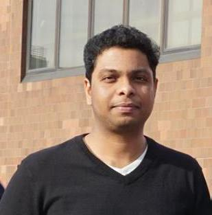

### `Hello! I am glad you could join me today!`

  

[:fontawesome-brands-twitter:{ .scale-icon }](https://twitter.com/HemuManju)

[:fontawesome-brands-github:{ .scale-icon }](https://github.com/HemuManju)

[:fontawesome-solid-graduation-cap:{ .scale-icon }](https://scholar.google.com/citations?user=V4zaTKIAAAAJ&hl=en&oi=ao)

[:fontawesome-brands-linkedin:{ .scale-icon }](https://www.linkedin.com/in/hemanth-manjunatha-73464059/)

!!! tip ""

    I am a postdoctoral researcher at Georgia Institute of Techonolgy exploring Reinforcement Learning, Human Robot/Swarm Interaction, and Brain Computer Interfaces. My long-term goal is to contribute towards developing science that enables humans and machines to be a synergistic team.

## `Research Goals`

- Developing theories for what levels and types of human modeling are needed for effective teaming with machines, specifically by considering neurophysiological modalities
- Developing learning algorithms that enable machines to learn and adapt their behavior directly from human intentions, demonstration, and instructions
- Developing learning algorithms that learn from human agents and provide an explanation at different levels of abstraction in complex collaborative tasks.